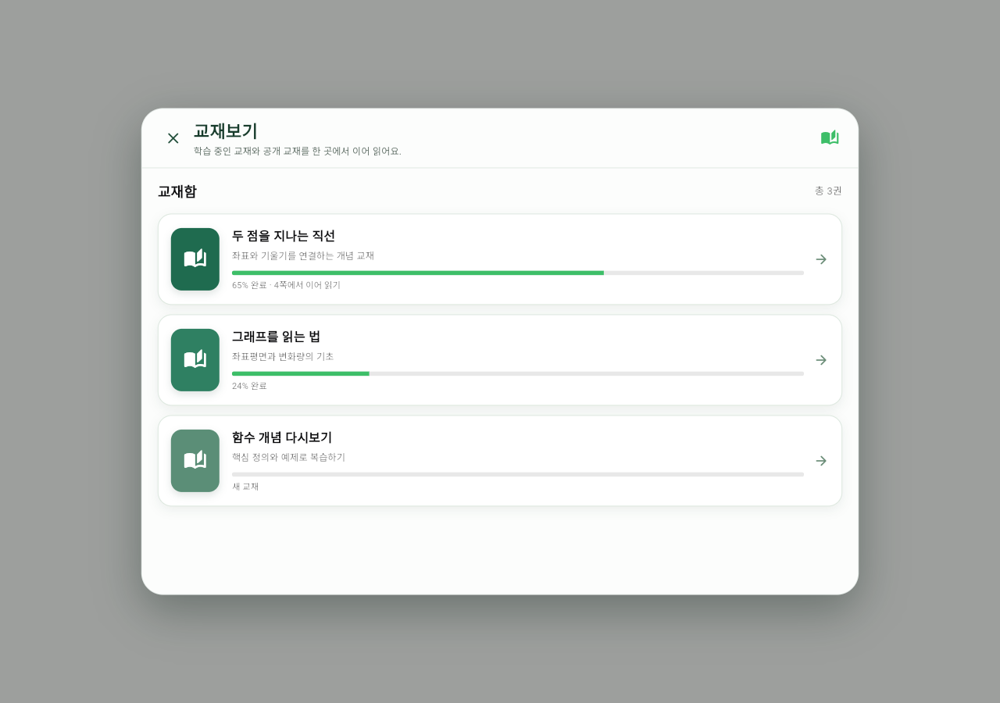
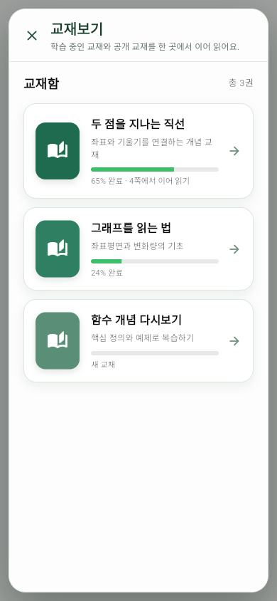
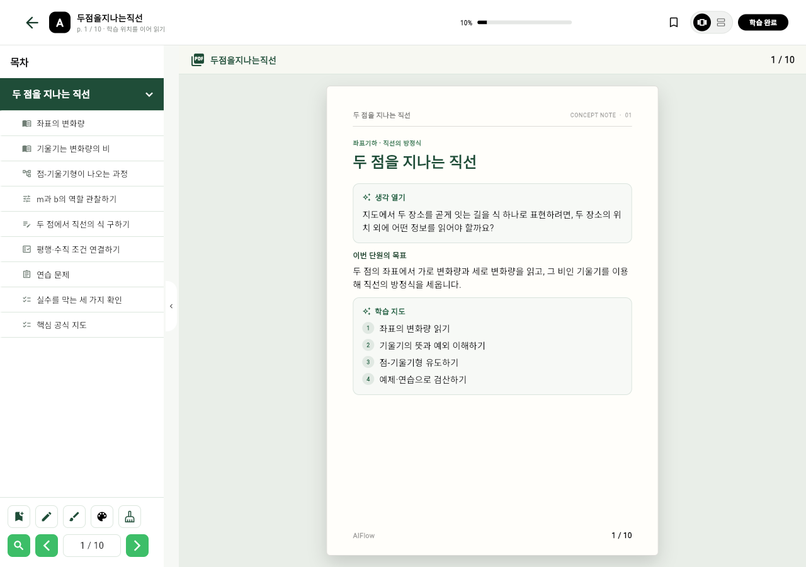

# 교재보기 리디자인 사용 설명서

## 목표

학생용 교재보기는 레퍼런스의 흐름을 따라 **교재함에서 교재를 고르고, 전면 리더에서 목차·본문·도구를 함께 사용하는 구조**로 정리했습니다. 목록에서는 지금 읽을 교재와 진행 위치를 즉시 판단하고, 열람 중에는 학습 맥락을 놓치지 않도록 했습니다.

## 1. 교재함에서 시작하기

`교재보기`를 열면 학습 중인 교재와 공개 교재가 한 화면에 나타납니다.

- 표지 색은 교재를 빠르게 구분합니다.
- 제목 아래에는 교재의 학습 범위를 짧게 안내합니다.
- 진행 막대와 문구는 마지막 읽기 위치를 보여 줍니다.
- 카드를 누르거나 오른쪽 화살표를 누르면 해당 교재의 리더로 이동합니다.
- 왼쪽 상단의 `×`로 교재함을 닫을 수 있습니다.

모바일에서는 같은 정보를 세로 카드로 재배치합니다. 제목이 길어져도 진행률과 이동 버튼이 밀리지 않도록 카드 내부가 유연하게 줄바꿈됩니다.

## 2. 교재 리더 사용하기

교재를 선택하면 전면 리더가 열립니다.

1. 왼쪽 목차에서 장·절을 선택합니다.
2. 가운데 지면에서 개념, 수식, 그래프를 읽습니다.
3. 하단 도구에서 북마크, 펜, 형광펜, 색상, 지우개를 사용합니다.
4. 검색 또는 이전/다음 버튼으로 원하는 페이지로 이동합니다.
5. 상단의 학습 진행률과 `학습 완료`로 현재 학습 상태를 확인합니다.

## 동작 기준

- 교재함은 작은 화면에서 화면 밖으로 넘치지 않는 반응형 모달입니다.
- 교재 목록은 `ListView.builder`를 사용하므로 교재 수가 늘어나도 보이는 카드만 렌더링합니다.
- 본문 리더는 기존 목차, 페이지 모드, 북마크, 필기 저장 흐름을 그대로 사용합니다.
- 교재 데이터와 진행률 API 계약은 변경하지 않았습니다. 이번 변경은 학생 열람 경험을 위한 화면 구조와 시각 계층에 한정됩니다.
- 개념 교재의 절은 정의·원리·예제·풀이·정리 흐름으로 문단을 정규화하며, 직선·이차함수/부등식·지수함수·미분/극값 단원에는 실제 JSXGraph 삽화를 연결합니다.
- 그래프에 `a`, `b`, `c`, 기울기, 절편, 밑 등의 매개변수가 있으면 그래프 오른쪽 도구 영역에 슬라이더가 표시됩니다. 값을 움직이면 수식을 다시 작성하지 않고 그래프만 즉시 갱신합니다.

## 검증 기록

- `flutter analyze lib/sessions/textbook/ui/pages/book_page.dart tool/student_density_preview.dart` 통과
- Flutter Web 빌드 결과를 Edge headless에서 1280×900, 390×844로 직접 캡처
- 전체 `student_density_responsive_test.dart`는 기존 `TodayTasksModal` 생성자 계약 불일치(`initialTasksByDate`)로 로드 단계에서 실패합니다. 교재보기 변경과는 무관한 기존 테스트 파일 상태입니다.
