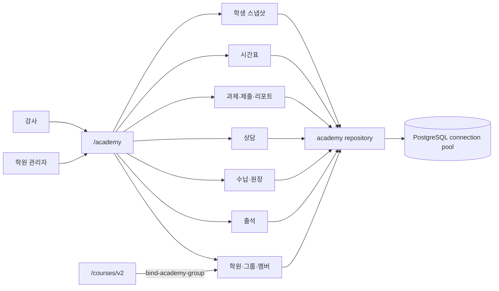

# 학원 운영 API

> [!warning] v2 여부
> 실제 prefix는 `/academy`이며 `/academy/v2`가 아니다. v2 표기는 연계 코스 API인 `/courses/v2`에만 있다.

| 기능 | 주요 경로 |
|---|---|
| 학원 | `POST/GET /academy`, `GET/PUT/DELETE /academy/{academy_id}` |
| 그룹·멤버 | `/academy/groups`, `/academy/members` |
| 출석 | `/academy/attendance`, `/academy/attendance/stats/...` |
| 수납·회계 | `/academy/tuition`, `/academy/ledger` |
| 상담 | `/academy/consult` |
| 과제 | `/academy/assignments`, `/academy/submissions`, `/academy/reports` |
| 시간표 | `/academy/timetable/preferences`, `/academy/timetable/plans` |
| 분석 | `/academy/analysis/...`, `/academy/snapshots` |

연결 코드는 PostgreSQL로 전환됐고 스키마는 `005_core_api.sql`에 있다. 기존 데이터의 전 행 이관·해시 검증 전까지는 배포 차단 대상이다.

