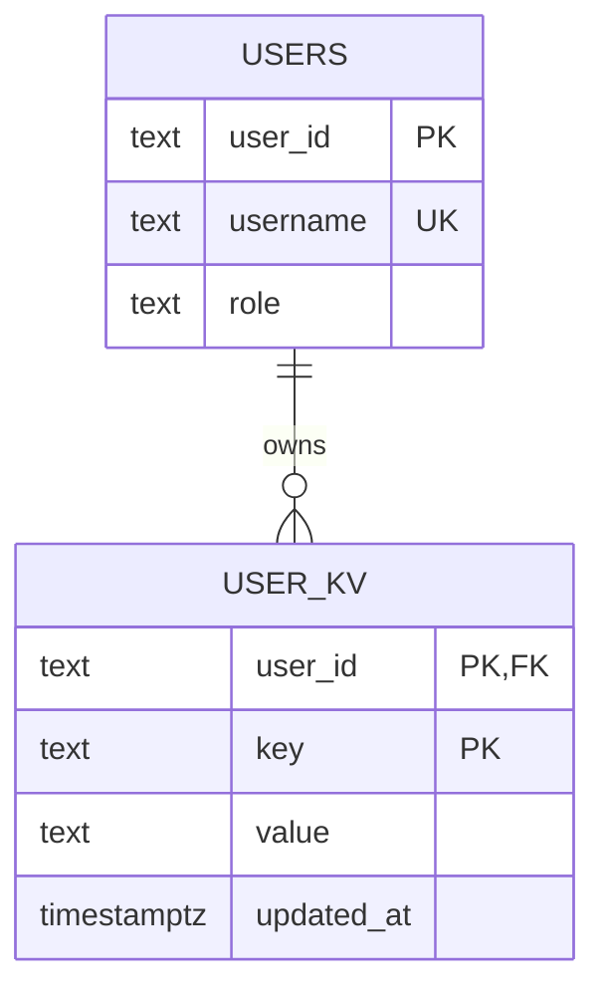
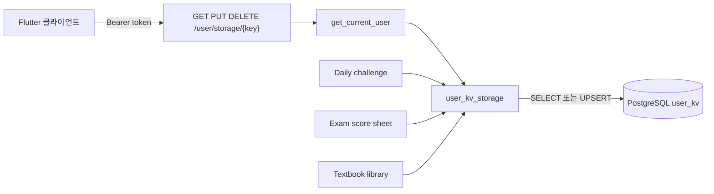

# KV 테이블과 사용자 저장 API

`(user_id, key)` 복합 기본키이므로 한 사용자가 같은 키를 중복 보유할 수 없다. `value`는 UTF-8 문자열이며 현재 호출부는 주로 JSON 문자열을 넣는다.

## 키 네임스페이스

| 키 | 용도 |
|---|---|
| `problem_history_v2` | 문제 이력 JSON |
| `exam_score_sheet:{exam_id}` | 시험별 점수 JSON |
| `textbook_library_v1` | 교재 메타데이터 JSON |
| `daily_quests:{course_id}:{date}` | 날짜별 퀘스트 상태 JSON |
| 임의 사용자 키 | `/user/storage/{key}` 제공 문자열 |

> [!warning] 리스크
> 임의 키 API는 값 크기, 허용 키 목록, TTL이 없다. 요청 본문·키 길이·사용자별 quota를 추가해야 한다.

- 스키마: `omj/migrations/postgres/004_user_kv.sql`
- 저장소: `omj/storage/user_kv_storage.py`
- `DATABASE_URL`이 없거나 마이그레이션 004가 없으면 시작 실패한다.

