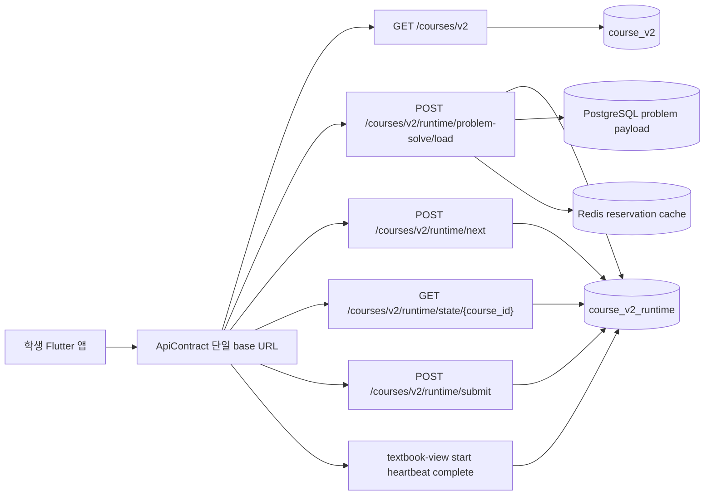
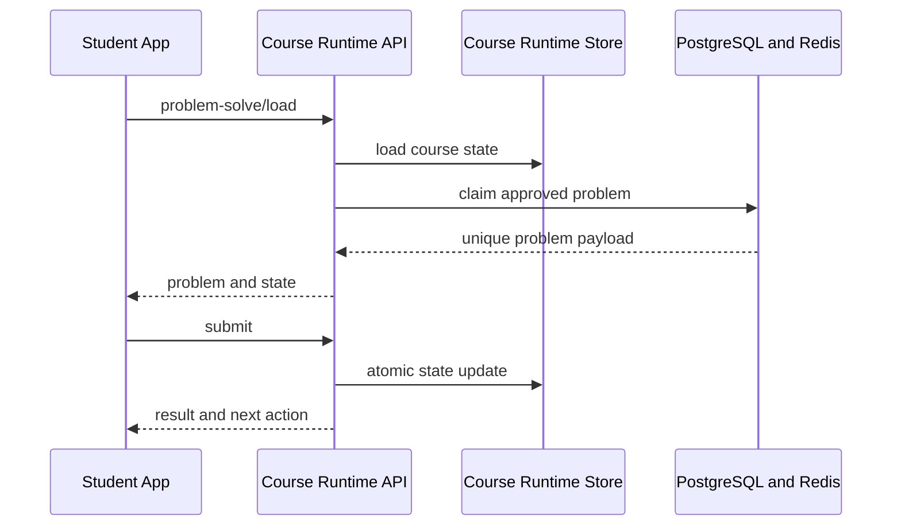

# 학생 학습 API

| 계열 | 용도 | 사용자 |
|---|---|---|
| `/courses/v2` | 코스 CRUD·조회·학원 그룹 연결 | 강사·관리자 중심, 학생 조회 |
| `/courses/v2/runtime` | 문제 로드·다음 단계·상태·제출·교재 열람 | 학생 중심 |
| `/courses` | 기존 코스 API | 레거시 호환 |
| `/user/storage/{key}` | 학생별 비정형 상태 | 인증 사용자 |

문제·레이팅·코스 v2 운영 연결은 PostgreSQL로 전환했다. 교재와 레거시 코스 등 보조 저장소는 별도 전환 검증이 필요하다.

