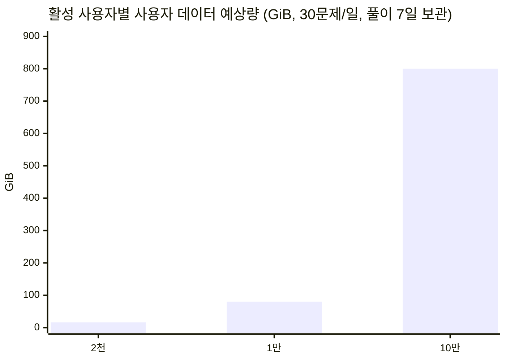
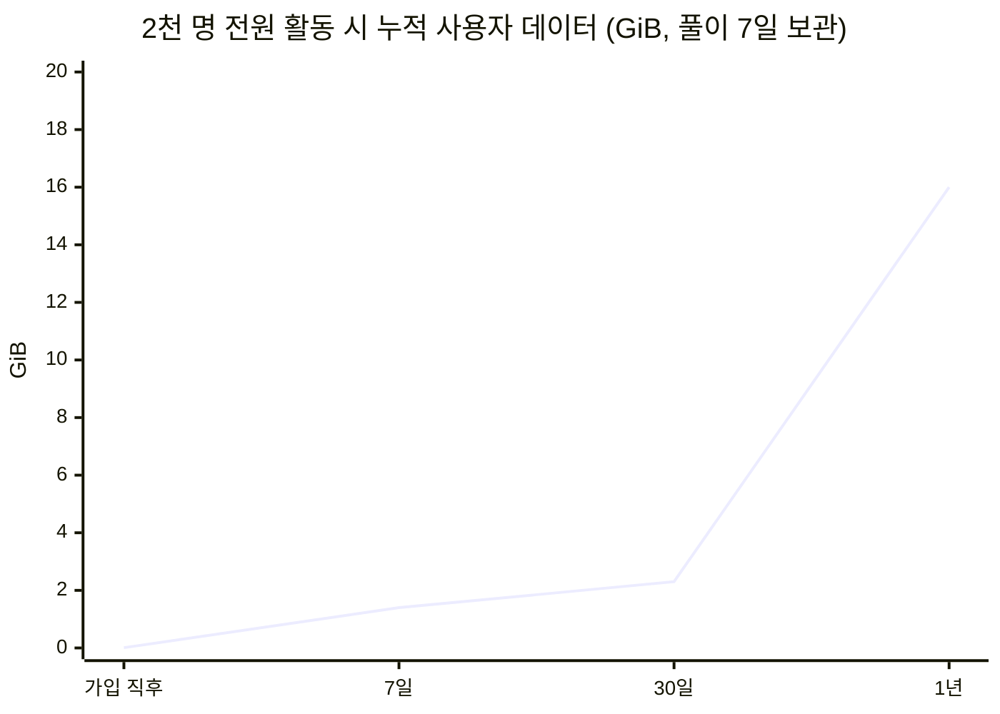

# 운영 DB 적재량 분석 보고서

> 작성일: 2026-07-14 (KST)
> 범위: 운영 서버가 사용하는 SQLite DB와 PostgreSQL Arena 영구 스키마. 로컬 백업(`*.bak`), SQLite 임시 파일(`-wal`, `-shm`), 테스트 DB 및 브라우저 로컬 저장소는 산정에서 제외했다.

## 결론

- 풀이 분석 이미지(학생 풀이·문제·히트맵)는 서버 파일 시스템에 저장하지 않으며, 풀이 이력은 이의신청 대비 최근 7일만 보관한다.
- 사용자가 하루 30문제를 풀면, **첫 7일 동안 약 0.10 MiB/일/활성 사용자**가 늘어난다. 2,000명 전원이 활동하면 약 **200 MiB/일**이다.
- `solve_history`는 7일 보관 정책으로 사용자당 약 **0.62 MiB**에서 안정화된다. `student_point_ledger`, `student_activity_score_ledger`, `rating_submission`에는 보존 기간이 없어 장기적으로 계속 증가한다.
- 30문제/일을 1년간 유지하고 평점 제출·일일 보상도 사용한다는 보수적 상한에서, 사용자 데이터는 **약 8 MiB/활성 사용자/년**이다. 따라서 2천/1만/10만 명은 각각 약 **16/80/800 GiB**의 주 DB 공간을 요구한다.
- 운영 권장 시작 용량은 2천 명 기준 **150 GiB SSD**, 1만 명 **750 GiB**, 10만 명 **6 TiB 이상**이다. 이는 데이터 파일, WAL 피크, 여유율, 백업본을 분리해 잡은 운영 용량이다.

용량과 별개로 현재 구조는 SQLite의 단일 쓰기 특성 때문에 “동시 접속 2,000명 이상·DB 쓰기 빈번” 조건에 맞지 않는다. WAL은 읽기 병행성만 개선하며, 다수의 동시 쓰기를 수평 확장하지 않는다. 1만 명 이전에 PostgreSQL 등 서버형 DB로 사용자 쓰기 테이블을 이전하는 것이 필요하다.

## 조사 기준과 실제 파일 역추적 결과

코드의 기본 운영 경로는 다음과 같다.

| DB | 운영 경로 결정 | 현재 분석 파일 | 크기 | 역할 |
|---|---|---:|---:|---|
| `quests.db` | `QUEST_DB_PATH`, 미설정 시 `omj/quests.db` | `quests.db` | 5.14 MiB | 사용자, 풀이, 문제, 시험, 수업, 원장 |
| `codebases.db` | `CODEBASE_DB_PATH`, 미설정 시 `omj/codebases.db` | `codebases.db` | 9.67 MiB | 문제 생성 코드베이스·seed 캐시·검증 로그 |
| `textbook.db` | 고정 경로 `omj/textbook.db` | `textbook.db` | 24 KiB | 교과서 메타데이터 |
| Arena PostgreSQL | `arena/schema_postgresql.sql` | 스키마만 존재 | - | 대결 전적·답안·XP 원장 |

실제 서버 파일 자체는 제공되지 않았으므로, 위 수치는 배포물에 포함된 DB 파일을 직접 읽은 **초기 데이터/행 크기 표본**이다. 운영 서버에 접속해 실측한 값은 아니다. `quests.db-wal`(12 KiB), `quests.db-shm`(32 KiB), `quests.db.bak_*`(4.87 MiB)는 의도적으로 제외했다.

기존 디버깅 산출물인 `assets/solve_images`에는 현재 150개, 3.99 MiB 파일이 남아 있다. 새 요청부터는 저장되지 않지만, 이미 존재하는 파일은 자동 삭제하지 않았다. 운영 서버의 기존 파일은 배포 시 별도 1회 정리 대상이다.

`quests.db`는 4 KiB 페이지 1,315개(여유 페이지 2개)로 거의 5.14 MiB를 사용한다. 그 안에는 현재 문제 476개와 풀이 단계 1,746개가 이미 있어, 파일 전체 크기를 사용자 데이터로 나누지 않았다.

## 전체 DB 값과 상세 구성

### `quests.db`: 현재 비어 있지 않은 테이블

| 분류 | 테이블 (현재 행 수) | 실제 평균 논리 행 길이 | 설명 |
|---|---|---:|---|
| 계정 | `users` (12) | 196 B | 로그인 ID, 비밀번호 해시(64 B), salt(32 B), 프로필 |
| 풀이 이력 | `solve_history` (33) | 2,053 문자 / JSON 평균 2,581 UTF-8 B | 채점 결과·OCR/수식·정답 상태. 가장 큰 사용자 데이터 |
| 평점 | `user_rating` (11) | 135 B | 사용자 평점·최근 결과 |
| 평점 | `user_tag_stats` (150) | 99 B | 태그별 시도·평점. 태그 수만큼 최초 생성 후 주로 갱신 |
| 약점 | `user_weakness_tags` (36) | 64 B | 약점 태그별 누적 횟수 |
| 포인트 | `student_account_stats` (46) | 37 B | 사용자별 집계(갱신형) |
| 포인트 | `student_daily_point_usage` (52) | 48 B | 사용자·일자별 보상 집계 |
| 포인트 | `student_point_ledger` (102) | 123 B | 포인트 지급 원장, 현재 삭제 정책 없음 |
| 활동 점수 | `student_activity_score_ledger` (6) | 181 B | 활동 점수 원장, 현재 삭제 정책 없음 |
| 사용자 상태 | `user_kv` (148) | 1,387 B | 화면/기능 상태 저장. 값 크기에 따라 크게 변동 |
| 이어하기 | `continue_session` (2) | 108 B | 미완료 풀이의 필기 JSON, 사용자당 종류별 1건으로 갱신 |
| 변형 문제함 | `quest_variant_tray` (3) | 1,075 B | 사용자별 생성 문제 payload |
| 소셜 | `friend_requests` (5), `friends` (8), `messages` (20) | 92~141 B | 친구·메시지. 메시지 보존 정책 없음 |
| 채팅 | `serverchat_history` (4), `serverchat_call_log` (1), `serverchat_usage_daily` (2) | 48~163 B | 채팅 문구·호출 사용량 |
| 작업 | `job_state` (18), `job_event_log` (45) | 3,194 B / 99 B | AI 생성 작업 payload/result와 상태 변경 로그 |
| 문제 | `quest_header`/`quest_info`/`quest_data` (각 476), `solve_step` (1,746) | 37 / 198 / 568 / 1,103 B | 공용 문제은행. 사용자 수와 무관 |
| 시험 | `exam` (37), `exam_item` (471), `exam_paper` (1) | 5,156 / 149 B | 생성 시험. `exam.params`가 커서 사용자 생성량에 비례 가능 |
| 레벨 테스트 | template (5), template item (250) | 678 / 163 B | 공용 템플릿 |
| 교육과정 | `course_v2` (82), runtime (1) | 1,302 / 1,384 B | 수업 정의는 공용, runtime은 사용자별 |
| 기타 공용/운영 | daily challenge template (60), OX 문제 (39), store item (3), 그룹/문서 등 | - | 현재 대부분 0건 또는 소량 |

비어 있는 테이블도 운영 기능이 사용되면 증가한다. 특히 `challenge`, `level_test_*`, `course_v2_runtime`, `user_course`, `exam_editor_*`, 학원·그룹·공지·교사 문서 테이블은 사용자/교사 기능 사용량에 따라 별도 증가한다. 이 보고서의 핵심 시나리오는 “일반 학생 30문제 풀이”이며, AI 시험 생성·이미지·채팅 본문·문서 첨부는 포함하지 않았다.

### `codebases.db`: 사용자와 무관한 운영 적재

| 테이블 | 현재 행 수 | 평균 논리 행 길이 | 현재 의미 |
|---|---:|---:|---|
| `codebases` | 246 | 11.46 KiB | 문제 생성 코드/프롬프트/검증 seed 목록 |
| `codebase_seed_cache` | 15,394 | 99 B | 유효 seed 캐시 |
| `codebase_seed_logs` | 15,472 | 117 B | seed 검증 시도 로그, 삭제 정책 없음 |
| `codebase_seed_stats` | 246 | 90 B | 코드베이스별 누적 통계 |
| `codebase_agent_logs` | 128 | 187 B | 생성·수리 작업 로그 |

현재 `codebases.db`는 9.67 MiB다. 코드베이스 하나당 평균 약 11.5 KiB, seed cache/log 한 쌍당 인덱스 포함 약 0.3~0.5 KiB를 잡으면 된다. 이 DB가 운영 서버에서 생성기를 함께 구동할 때만 서버 DB에 포함된다. 일반 사용자 풀이 자체는 이 DB에 행을 쓰지 않는다.

## 사용자 1명 가입 시 적재량

회원가입 SQL은 `users`에 한 행을 삽입한다. UUID, 해시, salt, 기본 프로필 기준 논리 데이터는 약 0.20 KiB이며, 기본키와 username UNIQUE 인덱스·SQLite 셀 오버헤드를 포함한 물리 예약량은 **약 0.6~1.0 KiB/명**으로 산정했다.

가입 직후 평점/포인트 API를 한 번만 호출하면 `user_rating`, `student_account_stats`, 당일 `student_daily_point_usage`가 추가되어 **약 2~4 KiB/명**이 된다. 프로필 이미지를 DB에 base64로 저장하는 경우는 이 수치에 포함되지 않으며, 이미지 파일은 반드시 오브젝트 스토리지로 분리해야 한다.

## 사용자 1명, 하루 30문제 풀이 시 적재량

### 1일 증가량 (정상 풀이, 이미지/채팅/시험 생성 제외)

| 항목 | 행/갱신 수 | 보수적 디스크 증가량 | 근거 |
|---|---:|---:|---|
| `solve_history` | 삽입 30건 | 약 90 KiB | 표본 JSON 2,581 B + 본문 컬럼/사용자·시간 인덱스 포함 약 3 KiB/건 |
| `rating_submission` | 최대 30건 | 약 8 KiB | 평점 제출 API를 문제마다 호출하는 경우, 기본키 인덱스 포함 약 0.25 KiB/건 |
| `student_point_ledger` | 최대 5건 | 약 3 KiB | 일일 100점 한도, 문제당 20점이므로 최대 5건; 두 인덱스 포함 약 0.5 KiB/건 |
| `student_daily_point_usage` | 첫날 1건, 이후 갱신 | 약 0.2 KiB | 사용자·일자 키, 하루 한 행 |
| `student_activity_score_ledger` | 사용 방식에 따라 0~30건 | 0~15 KiB | 활동 점수 API가 문제별로 호출될 때만 발생 |
| `user_rating`, `user_tag_stats`, 약점/집계 | 갱신 및 신규 태그 | 약 1~4 KiB | 대부분 UPDATE; 새 태그만 행 증가 |
| 합계 | - | **약 0.10~0.12 MiB/일/명** | 활동 점수 원장을 문제별로 쓰는 보수적 값 |

이 값은 최초 7일 동안 선형으로 증가한 뒤, 만료 풀이 이력이 삭제되어 안정화된다. 이미지 원본은 서버 디스크에 기록하지 않으므로 이 산정에서 제외했다.

### 7일 보존 정책을 반영한 사용자당 누적량

| 구간 | 계산 | 사용자당 예상 |
|---|---|---:|
| 최근 7일 풀이 원본 | 30문제 × 7일 × 3 KiB | 0.62 MiB |
| 압축 보관 구간 | 없음 | 0 MiB |
| 풀이 이력 안정화 합계 | 210건, 7일 보존 | **약 0.62 MiB** |
| 1년 포인트 원장 | 최대 5건/일 × 0.5 KiB × 365일 | 약 0.9 MiB |
| 1년 평점 제출 원장 | 30건/일 × 0.25 KiB × 365일 | 약 2.7 MiB |
| 태그/계정/일자 집계 | 태그 15개, 일자 365개 등 | 약 0.1~0.3 MiB |
| **1년 사용자 합계** | 이미지·채팅·시험 제외 | **약 8 MiB/활성 사용자** |

풀이 분석 이미지(학생 풀이·문제·히트맵)는 서버 파일 시스템에 기록하지 않는다. 풀이 이력은 클라이언트의 `local_storage`·device kind 플래그와 무관하게 서버에서 7일 후 삭제된다.

## 2천·1만·10만 명 시나리오

가정: 모든 사용자가 매일 30문제를 풀고, 일일 보상·평점 제출을 사용한다. 가입자 수와 DAU가 같다는 가장 보수적인 상한이다.

| 활성 사용자 | 일일 신규 증가량 (초기 7일) | 7일 후 풀이 이력 | 1년 사용자 데이터 | 권장 주 DB SSD |
|---:|---:|---:|---:|---:|
| 2,000명 | 약 200~240 MiB/일 | 약 1.4~1.6 GiB | 약 16 GiB | **150 GiB** |
| 10,000명 | 약 1.0~1.2 GiB/일 | 약 7.0~8.2 GiB | 약 80 GiB | **750 GiB** |
| 100,000명 | 약 10~12 GiB/일 | 약 70~82 GiB | 약 0.8 TiB | **6 TiB 이상** |

권장 SSD는 데이터만의 2배 여유, SQLite WAL 피크(활성 쓰기 구간), 인덱스/단편화, 최소 1개 백업본을 고려한 값이다. DB 백업을 같은 볼륨에 두지 않는 것을 전제로 한다. 풀이 이미지·OCR 원본은 서버에 보관하지 않는다.

## 5년 예상 데이터: 무기한 누적하지 않는 정책 기준

풀이 이미지와 풀이 원문, 평점 제출 식별자, 풀이로 발생한 포인트·활동 원장은 모두 7일 후 삭제하고, 사용자별 **집계값**(`users`, `user_rating`, `user_tag_stats`, `student_account_stats`)만 유지한다는 정책 기준이다. 이 경우 5년이 지나도 풀이 원문은 7일치만 남으므로 사용자당 약 **0.8~1.0 MiB**로 안정화된다. 즉 5년 용량은 1년의 5배가 아니다.

| 활성 사용자 | 7일 이후 안정 사용자 데이터 | 5년 후에도 유지되는 예상량 | 운영 DB 권장 SSD |
|---:|---:|---:|---:|
| 2,000명 | 약 1.6~2.0 GiB | 약 1.6~2.0 GiB | **50 GiB** |
| 10,000명 | 약 7.8~9.8 GiB | 약 7.8~9.8 GiB | **200 GiB** |
| 100,000명 | 약 78~98 GiB | 약 78~98 GiB | **1 TiB** |

위 수치에는 공용 문제은행·코드베이스 DB의 현재 약 15 MiB와 향후 콘텐츠 증가는 별도로 더해야 한다. 100,000명에서도 실제 용량보다 동시 쓰기 성능이 먼저 병목이 되므로, 사용자 데이터는 PostgreSQL 같은 서버형 DB에 두는 전제가 필요하다.

### 현재 코드와 목표 정책의 차이

현재 반영된 코드는 이미지 저장을 중단하고 `solve_history`를 7일 보관한다. 그러나 `rating_submission`, `student_point_ledger`, `student_activity_score_ledger`, `student_daily_point_usage`에는 아직 7일 삭제 처리가 없다. 이를 그대로 두면 5년 후에는 사용자당 약 **38 MiB**, 즉 2천/1만/10만 명에서 약 **74 GiB / 371 GiB / 3.6 TiB**까지 증가할 수 있다. 따라서 위의 “5년 후에도 안정” 수치는 해당 원장에도 7일 보존 정책을 적용했을 때의 목표값이다.

## 예상 그래프

## 사용자와 관계없이 쌓이는 양

| 발생원 | 현재량/표본 | 증가 방식 | 관리 기준 |
|---|---:|---|---|
| 문제은행 `quest_*`, `solve_step` | 문제 476개, 단계 1,746개 | 문제 1개당 평균 약 5 KiB(표본 기준, 단계 수에 비례) | 출제/생성 수에 따른 별도 예산 |
| 코드베이스 | 246개, 9.67 MiB DB | 코드베이스당 약 11.5 KiB + seed 검증 로그 | codebase seed 로그/캐시 TTL 또는 아카이브 필요 |
| AI 작업 `job_state`/`job_event_log` | state 평균 3.1 KiB | 생성 요청 수와 result JSON 크기에 비례 | 완료 작업 결과·이벤트 30~90일 보관 권장 |
| 시험 `exam` | 평균 5.0 KiB/행 | 교사/사용자 시험 생성 수에 비례 | 만료 시험/params 보존 기간 정의 필요 |
| 일일 챌린지·레벨 테스트 템플릿 | 소량 | 운영자가 콘텐츠를 추가할 때 | 사실상 정적 |
| Arena PostgreSQL | 빈 운영 데이터 | 매치·참가자·문항·제출·XP 원장에 비례 | `arena_submission`, `arena_tag_xp_ledger` 월별 파티셔닝/보존 필요 |

Arena의 경우 답안 본문과 `arena_match_question.payload JSONB`의 실제 크기가 없어서 수치 모델에는 넣지 않았다. 대결 기능을 활성화하면 사용자 풀이 30건과 별개로 증가하므로, PostgreSQL에서 매치 단위 실측 후 같은 방식으로 별도 예산을 잡아야 한다.

## 즉시 필요한 운영 조치

1. `student_point_ledger`, `student_activity_score_ledger`, `rating_submission`, `messages`, `serverchat_history`, `job_event_log`, `codebase_seed_logs`에 보존 기간 또는 월별 아카이브 정책을 정한다. 이것이 없으면 위 1년 추정 이후에도 선형 증가한다.
2. 운영 환경에서 `QUEST_DB_PATH`와 `CODEBASE_DB_PATH`를 별도 디스크로 지정하고, 매일 `page_count`, `freelist_count`, 테이블별 행 수와 WAL 크기를 수집한다. SQLite 파일 자체만 보면 테이블별 사용량을 정확히 나눌 수 없기 때문이다.
3. 동시 접속 2,000명 조건에서는 사용자 쓰기 테이블부터 PostgreSQL로 이전한다. SQLite를 유지한다면 단일 writer queue, 짧은 트랜잭션, WAL 체크포인트, 읽기 replica가 필요하지만 근본적 단일 writer 제약은 남는다.
4. 2천 명 서비스 시작 전 최소 30일간 실운영에서 `solve_history.data`의 P50/P95/P99 바이트와 일별 insert 수를 수집해, 이 보고서의 평균값(2,581 B)을 실제 페이로드로 교체한다.

## 산정식

초기 7일 일일 증가량은 다음과 같다.

`활성 사용자 수 × (30 × 3 KiB + 30 × 0.25 KiB + 5 × 0.5 KiB + 기타 1~19 KiB)`

7일 풀이 이력 안정화 값은 다음과 같다.

`활성 사용자 수 × (30 × 7 × 3 KiB)`

위 식의 3 KiB에는 풀이 JSON, SQLite 레코드 오버헤드와 `solve_history(user_id, created_at)` 인덱스 증가분을 보수적으로 포함했다. 값이 큰 OCR 배열, 시험 params, 채팅 본문은 표본 평균보다 훨씬 클 수 있으므로 본문 자체를 DB에 저장하는 기능은 별도 상한을 둬야 한다.
